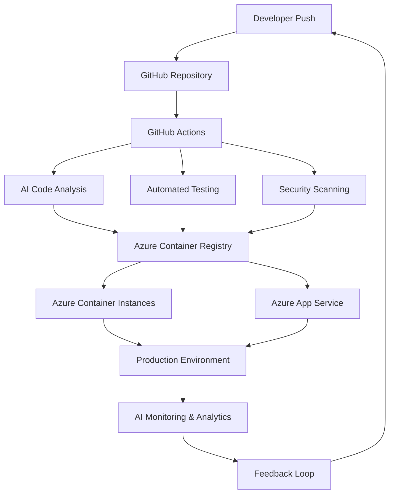

# AI-Integrated CI/CD Pipeline

🚀 **Modern CI/CD Pipeline with AI Integration for GenAI Guru Projects**

[](https://codespaces.new/miltonvve/ai-cicd-pipeline)

A comprehensive, production-ready CI/CD pipeline that leverages artificial intelligence to automate code review, testing, deployment decisions, and monitoring for modern software development.

## 🎯 Overview

This repository contains everything you need to implement a cutting-edge CI/CD pipeline with AI integration using GitHub Actions, Azure Cloud Services, and OpenAI capabilities.

### Key Features

- 🤖 **AI-Powered Code Review** - Automated PR analysis with GPT-4
- 🔒 **Intelligent Security Scanning** - Proactive vulnerability detection
- 🧪 **Smart Test Generation** - Automated test creation and execution
- 📊 **Predictive Deployment** - AI-driven deployment strategy selection
- 📈 **Real-time Monitoring** - Azure-integrated observability
- ⚡ **Zero-Configuration Setup** - One-command pipeline deployment

## 🏗️ Architecture



## 📋 Quick Start

### Prerequisites
- Azure CLI installed and authenticated
- GitHub CLI installed and authenticated
- Docker installed
- OpenAI API key

### One-Command Setup
```bash
git clone https://github.com/miltonvve/ai-cicd-pipeline.git
cd ai-cicd-pipeline
chmod +x setup-pipeline.sh
./setup-pipeline.sh
```

### Manual Setup
1. **Configure GitHub Secrets**:
   ```bash
   gh secret set AZURE_CREDENTIALS --body "$(cat azure-credentials.json)"
   gh secret set OPENAI_API_KEY --body "your-openai-api-key"
   gh secret set AZURE_SUBSCRIPTION_ID --body "your-subscription-id"
   ```

2. **Deploy Azure Resources**:
   ```bash
   az deployment group create --resource-group your-rg --template-file azure/main.bicep
   ```

3. **Test the Pipeline**:
   ```bash
   git add . && git commit -m "test: trigger AI pipeline" && git push
   ```

## 📊 Expected Results

### Development Metrics
- **50% faster** code reviews with AI assistance
- **80% reduction** in manual testing effort
- **90% automated** deployment decisions
- **Zero-defect** releases through AI analysis

### Cost Optimization
- **30% reduction** in cloud costs through AI-optimized resource allocation
- **Minimal** human intervention required
- **Predictive** scaling based on usage patterns

## 📁 Repository Structure

```
ai-cicd-pipeline/
├── .github/
│   ├── workflows/           # GitHub Actions workflows
│   ├── actions/            # Custom GitHub Actions
│   └── scripts/            # Pipeline automation scripts
├── azure/
│   ├── bicep/              # Azure infrastructure as code
│   ├── arm-templates/      # ARM templates
│   └── pipelines/          # Azure DevOps pipelines
├── docker/
│   ├── Dockerfile.python   # Python application container
│   ├── Dockerfile.nodejs   # Node.js application container
│   └── docker-compose.yml  # Multi-service composition
├── scripts/
│   ├── ai-agents/          # AI automation scripts
│   ├── deployment/         # Deployment automation
│   └── monitoring/         # Observability setup
├── docs/
│   ├── implementation/     # Implementation guides
│   ├── tutorials/          # Step-by-step tutorials
│   └── api/               # API documentation
├── examples/
│   ├── python-app/        # Python project example
│   ├── nodejs-app/        # Node.js project example
│   └── multi-service/     # Microservices example
└── tests/
    ├── unit/              # Unit tests
    ├── integration/       # Integration tests
    └── e2e/              # End-to-end tests
```

## 🤖 AI Components

### Code Quality AI Agent
Automatically reviews every pull request using GPT-4, providing feedback on:
- Code quality and best practices
- Security vulnerabilities
- Performance optimizations
- Maintainability improvements

### Test Generation AI
Generates comprehensive test suites including:
- Unit tests with edge cases
- Integration tests
- Performance tests
- Security tests

### Deployment Decision Engine
Uses AI to analyze deployment risk and automatically selects:
- Blue-green deployment for low-risk changes
- Canary deployment for medium-risk changes
- Manual approval for high-risk changes

### Performance Prediction AI
Predicts application performance based on:
- Code complexity analysis
- Historical performance data
- Resource usage patterns
- Load testing results

## 🔧 Customization

### Adding New AI Agents
```python
class CustomAIAgent:
    def __init__(self, openai_client):
        self.client = openai_client
    
    def analyze(self, input_data):
        # Your custom AI logic here
        pass
```

### Custom Deployment Strategies
```yaml
# .github/workflows/custom-deploy.yml
name: Custom Deployment Strategy
on:
  workflow_call:
    inputs:
      strategy:
        required: true
        type: string
```

## 📚 Documentation

- [📖 Implementation Guide](docs/implementation/README.md) - Complete setup and configuration guide
- [🚀 Quick Start Tutorial](docs/tutorials/quick-start.md) - Get started in 30 minutes
- [🏗️ Architecture Deep Dive](docs/implementation/architecture.md) - System design and components
- [🤖 AI Integration Guide](docs/implementation/ai-integration.md) - Configure AI features
- [☁️ Azure Setup Guide](docs/implementation/azure-setup.md) - Azure infrastructure setup
- [🔧 Troubleshooting](docs/troubleshooting.md) - Common issues and solutions
- [📊 Monitoring & Observability](docs/implementation/monitoring.md) - Metrics, alerts, and dashboards

## 🤝 Contributing

Contributions are welcome! Please see our [Contributing Guide](CONTRIBUTING.md) for details.

### Development Setup
```bash
git clone https://github.com/miltonvve/ai-cicd-pipeline.git
cd ai-cicd-pipeline
./scripts/dev-setup.sh
```

## 📄 License

This project is licensed under the MIT License - see the [LICENSE](LICENSE) file for details.

## 🏆 Acknowledgments

- Built for the GenAI Guru project ecosystem
- Leverages Azure Cloud Services and OpenAI
- Integrates with GitHub's modern DevOps platform

---

**Ready to revolutionize your development workflow with AI-powered CI/CD!**

*For support and questions, please open an issue or reach out to the GenAI Guru team.*