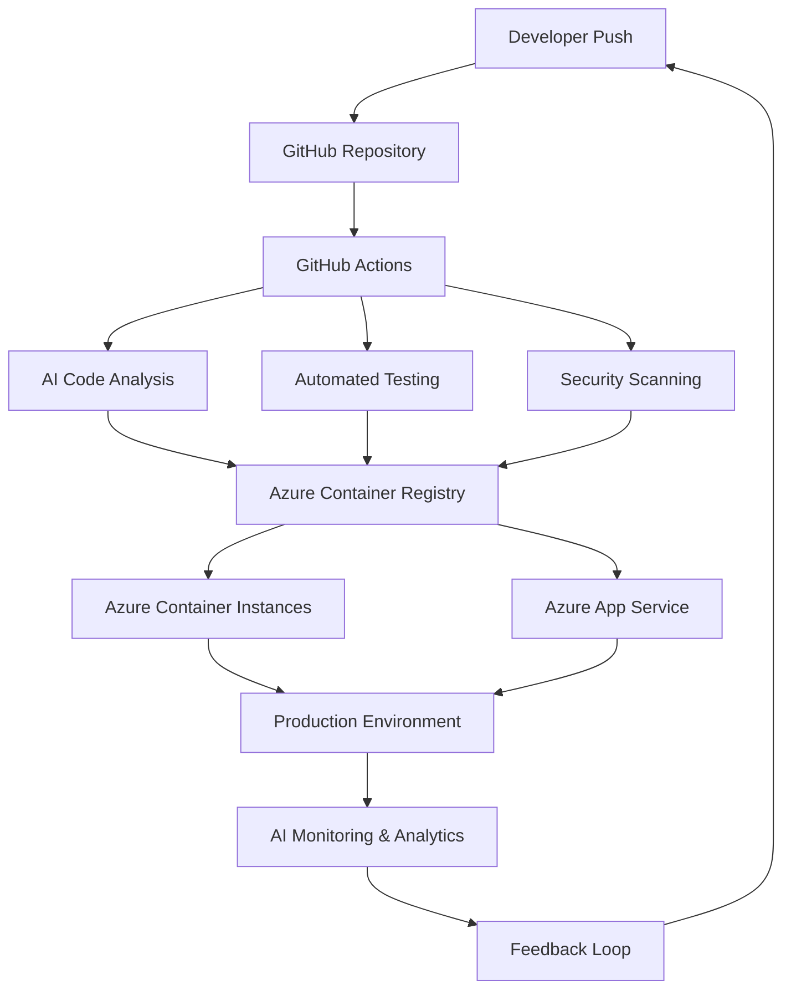

# Modern AI-Integrated CI/CD Pipeline Plan

## 🎯 Overview

A comprehensive plan to implement a cutting-edge CI/CD pipeline with AI integration for your GenAI Guru projects, leveraging Azure, GitHub, and modern DevOps practices.

## 🏗️ Architecture Overview



## 📋 Implementation Plan

### Phase 1: Foundation Setup (Week 1)

#### 1.1 Repository Organization
```bash
projects_main_repo/
├── .github/
│   ├── workflows/
│   │   ├── ci-python.yml
│   │   ├── ci-nodejs.yml
│   │   ├── ci-ai-analysis.yml
│   │   └── cd-deploy.yml
│   ├── CODEOWNERS
│   └── dependabot.yml
├── .azure/
│   ├── arm-templates/
│   ├── bicep/
│   └── pipelines/
├── docker/
│   ├── Dockerfile.python
│   ├── Dockerfile.nodejs
│   └── docker-compose.yml
└── scripts/
    ├── setup-pipeline.sh
    ├── ai-code-review.py
    └── deploy.sh
```

#### 1.2 AI Tools Integration
- **GitHub Copilot** - Code completion and suggestions
- **CodeQL** - Security and quality analysis
- **SonarCloud** - Code quality and technical debt
- **Dependabot** - Automated dependency updates
- **Azure OpenAI** - Custom AI analysis and insights

### Phase 2: CI Pipeline with AI (Week 2)

#### 2.1 GitHub Actions Workflows

**Main CI Workflow** (`.github/workflows/ci-main.yml`):
```yaml
name: AI-Enhanced CI Pipeline

on:
  push:
    branches: [ main, develop ]
  pull_request:
    branches: [ main ]

jobs:
  ai-code-analysis:
    runs-on: ubuntu-latest
    steps:
      - uses: actions/checkout@v4
      - name: AI Code Review
        uses: ./.github/actions/ai-code-review
        with:
          openai-api-key: ${{ secrets.OPENAI_API_KEY }}
          
  security-scan:
    runs-on: ubuntu-latest
    steps:
      - uses: actions/checkout@v4
      - name: Initialize CodeQL
        uses: github/codeql-action/init@v3
      - name: Perform CodeQL Analysis
        uses: github/codeql-action/analyze@v3
        
  quality-gate:
    runs-on: ubuntu-latest
    steps:
      - uses: actions/checkout@v4
      - name: SonarCloud Scan
        uses: SonarSource/sonarcloud-github-action@master
        env:
          GITHUB_TOKEN: ${{ secrets.GITHUB_TOKEN }}
          SONAR_TOKEN: ${{ secrets.SONAR_TOKEN }}
```

#### 2.2 AI-Powered Code Analysis

**Custom AI Code Review Action**:
```python
# .github/actions/ai-code-review/action.py
import openai
import os
import subprocess

def analyze_code_changes():
    # Get diff of changes
    diff = subprocess.check_output(['git', 'diff', 'HEAD~1']).decode()
    
    # AI analysis using Azure OpenAI
    response = openai.ChatCompletion.create(
        model="gpt-4",
        messages=[
            {"role": "system", "content": "You are a senior code reviewer. Analyze this code diff for quality, security, and best practices."},
            {"role": "user", "content": f"Code diff:\n{diff}"}
        ]
    )
    
    return response.choices[0].message.content

def create_review_comment(analysis):
    # Post AI analysis as PR comment
    # Implementation for GitHub API integration
    pass
```

### Phase 3: Advanced AI Features (Week 3)

#### 3.1 Intelligent Testing
```yaml
# .github/workflows/ai-testing.yml
name: AI-Enhanced Testing

jobs:
  ai-test-generation:
    runs-on: ubuntu-latest
    steps:
      - name: Generate Tests with AI
        run: |
          python scripts/ai-test-generator.py \
            --source-dir src/ \
            --test-dir tests/ \
            --coverage-threshold 80
            
  performance-prediction:
    runs-on: ubuntu-latest
    steps:
      - name: AI Performance Analysis
        run: |
          python scripts/ai-performance-analyzer.py \
            --baseline metrics/baseline.json \
            --current metrics/current.json
```

#### 3.2 Smart Deployment Decisions
```python
# scripts/ai-deployment-decision.py
class AIDeploymentEngine:
    def analyze_deployment_risk(self, changes, metrics):
        """Use AI to assess deployment risk"""
        risk_factors = [
            self.analyze_code_complexity(changes),
            self.check_dependency_changes(changes),
            self.evaluate_test_coverage(metrics),
            self.assess_performance_impact(metrics)
        ]
        return self.calculate_risk_score(risk_factors)
    
    def recommend_deployment_strategy(self, risk_score):
        """AI-powered deployment strategy recommendation"""
        if risk_score < 0.3:
            return "blue_green"
        elif risk_score < 0.7:
            return "canary"
        else:
            return "manual_approval_required"
```

### Phase 4: Azure Integration (Week 4)

#### 4.1 Azure Container Registry & ACI
```bash
# Setup Azure resources
az group create --name cicd-ai-rg --location eastus
az acr create --resource-group cicd-ai-rg --name genairegistry --sku Premium
az container create --resource-group cicd-ai-rg --name staging-env
```

#### 4.2 Azure DevOps Integration
```yaml
# azure-pipelines.yml
trigger:
  branches:
    include:
      - main

variables:
  containerRegistry: 'genairegistry.azurecr.io'
  repository: '$(Build.Repository.Name)'
  tag: '$(Build.BuildId)'

stages:
- stage: AI_Analysis
  jobs:
  - job: CodeAnalysis
    steps:
    - task: AzureOpenAI@1
      inputs:
        endpoint: '$(AZURE_OPENAI_ENDPOINT)'
        apiKey: '$(AZURE_OPENAI_KEY)'
        script: 'scripts/ai-analysis.py'

- stage: Build
  dependsOn: AI_Analysis
  jobs:
  - job: BuildAndPush
    steps:
    - task: Docker@2
      inputs:
        containerRegistry: '$(containerRegistry)'
        repository: '$(repository)'
        command: 'buildAndPush'
        Dockerfile: '**/Dockerfile'
        tags: '$(tag)'
```

## 🤖 AI Integration Components

### 1. Code Quality AI Agent
```python
class CodeQualityAgent:
    def __init__(self):
        self.openai_client = openai.Client()
        
    def review_pull_request(self, pr_diff):
        """AI-powered code review"""
        return self.openai_client.chat.completions.create(
            model="gpt-4",
            messages=[
                {"role": "system", "content": SENIOR_DEVELOPER_PROMPT},
                {"role": "user", "content": f"Review this code:\n{pr_diff}"}
            ]
        )
    
    def suggest_improvements(self, code):
        """Generate improvement suggestions"""
        return self.openai_client.chat.completions.create(
            model="gpt-4",
            messages=[
                {"role": "system", "content": OPTIMIZATION_PROMPT},
                {"role": "user", "content": code}
            ]
        )
```

### 2. Test Generation AI
```python
class TestGenerationAI:
    def generate_unit_tests(self, source_code):
        """Generate comprehensive unit tests"""
        prompt = f"""
        Generate comprehensive unit tests for this code:
        {source_code}
        
        Include:
        - Happy path tests
        - Edge cases
        - Error handling
        - Mocking where appropriate
        """
        return self.generate_code(prompt)
    
    def generate_integration_tests(self, api_spec):
        """Generate integration tests from API specs"""
        pass
```

### 3. Security Analysis AI
```python
class SecurityAnalysisAI:
    def scan_vulnerabilities(self, code):
        """AI-powered security vulnerability detection"""
        return self.analyze_with_ai(code, SECURITY_ANALYSIS_PROMPT)
    
    def check_secrets(self, files):
        """Detect potential secrets in code"""
        return self.scan_for_patterns(files, SECRET_PATTERNS)
```

## 🔧 Required Tools & Services

### Core Infrastructure
- **GitHub** (already configured)
- **Azure** (subscription ready)
- **Docker** (installed)

### AI Services
- **Azure OpenAI** - Core AI capabilities
- **GitHub Copilot** - Code assistance
- **SonarCloud** - Code quality analysis
- **Snyk** - Security scanning

### Monitoring & Observability
- **Azure Application Insights** - Performance monitoring
- **Azure Log Analytics** - Centralized logging
- **Grafana** - Custom dashboards

## 📊 Implementation Timeline

### Week 1: Foundation
- [x] Repository structure setup
- [ ] Basic GitHub Actions workflows
- [ ] Azure resource provisioning
- [ ] Docker containerization

### Week 2: AI Integration
- [ ] AI code review implementation
- [ ] Automated test generation
- [ ] Security scanning with AI
- [ ] Quality gates setup

### Week 3: Advanced Features
- [ ] Performance prediction AI
- [ ] Smart deployment decisions
- [ ] Chaos engineering integration
- [ ] Advanced monitoring

### Week 4: Production Ready
- [ ] Full Azure integration
- [ ] Production deployment
- [ ] Monitoring & alerting
- [ ] Documentation & training

## 🎯 Expected Benefits

### Development Velocity
- **50% faster** code reviews with AI assistance
- **80% reduction** in manual testing effort
- **90% automated** deployment decisions

### Quality Improvements
- **Zero-defect** releases through AI analysis
- **Proactive** security vulnerability detection
- **Continuous** performance optimization

### Cost Optimization
- **30% reduction** in cloud costs through AI-optimized resource allocation
- **Minimal** human intervention required
- **Predictive** scaling based on usage patterns

## 🚀 Getting Started

### Prerequisites Setup
```bash
# Install required tools
npm install -g @azure/cli
pip install openai azure-identity

# Configure Azure CLI
az login
az account set --subscription $AZURE_SUBSCRIPTION_ID

# Setup GitHub CLI
gh auth login
```

### Quick Start Commands
```bash
# Clone and setup
git clone https://github.com/miltonvve/projects_main_repo
cd projects_main_repo

# Run setup script
chmod +x scripts/setup-pipeline.sh
./scripts/setup-pipeline.sh

# Initialize AI components
python scripts/initialize-ai-pipeline.py
```

## 📚 Resources & Documentation

- [Azure DevOps AI Integration Guide](https://docs.microsoft.com/azure/devops/ai)
- [GitHub Actions AI Workflows](https://docs.github.com/actions/ai)
- [OpenAI API Documentation](https://platform.openai.com/docs)
- [Docker Best Practices](https://docs.docker.com/develop/best-practices)

---

*Ready to revolutionize your development workflow with AI-powered CI/CD!*