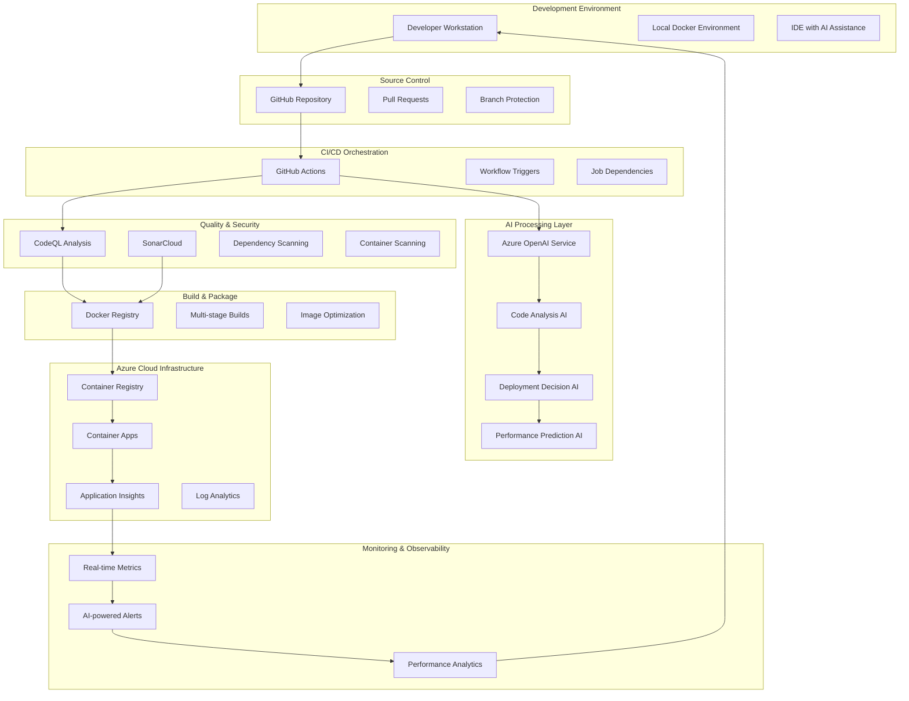
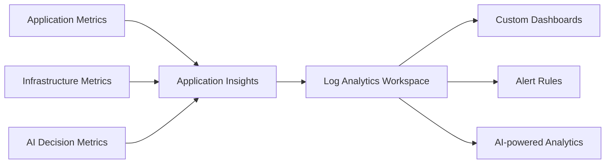
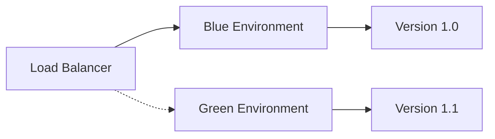
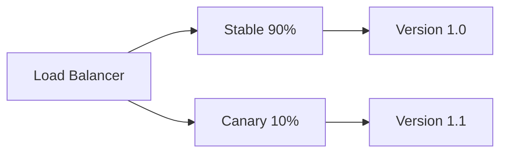
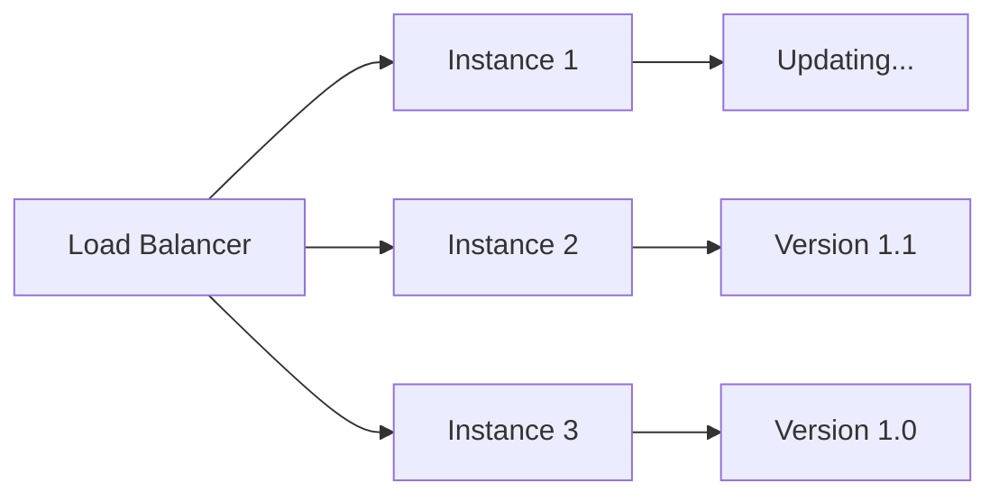

# 🏗️ Architecture Deep Dive

This document provides a comprehensive overview of the AI-Integrated CI/CD Pipeline architecture, including system design, data flow, and integration patterns.

## 📐 System Architecture Overview



## 🔄 Data Flow Architecture

### 1. Code Commit Flow
```
Developer Push → GitHub Webhook → GitHub Actions → AI Analysis → Quality Gates → Build → Deploy
```

### 2. AI Decision Flow
```
Code Changes → Complexity Analysis → Risk Assessment → Strategy Selection → Deployment Execution
```

### 3. Feedback Loop
```
Deployment Metrics → Performance Analysis → AI Learning → Improved Predictions → Better Decisions
```

## 🧩 Component Architecture

### GitHub Actions Orchestration Layer

**Primary Workflow: `.github/workflows/ci-main.yml`**
- **Trigger Events**: Push, Pull Request, Manual
- **Parallel Execution**: AI analysis, security scanning, quality checks
- **Conditional Logic**: Branch-based deployment strategies
- **Secret Management**: Secure credential handling

**Job Dependencies:**
```yaml
ai-code-analysis → security-scan → quality-gate → build-and-test → ai-deployment-decision → deploy
```

### AI Processing Architecture

#### 1. Code Review AI Engine
```python
class CodeReviewAI:
    Components:
        - GPT-4 Language Model
        - Context-aware Prompting
        - Multi-language Support
        - Security Pattern Recognition
    
    Input:
        - Git Diff Analysis
        - File-specific Context
        - Historical Data
    
    Output:
        - Quality Score (1-10)
        - Security Findings
        - Performance Recommendations
        - Best Practice Suggestions
```

#### 2. Deployment Decision Engine
```python
class DeploymentDecisionAI:
    Risk Factors:
        - Code Complexity Score
        - Dependency Changes
        - Test Coverage Analysis
        - Historical Failure Rates
    
    AI Models:
        - Risk Classification Model
        - Strategy Recommendation Model
        - Confidence Scoring Model
    
    Strategies:
        - Blue-Green Deployment
        - Canary Deployment
        - Manual Approval Required
```

#### 3. Performance Prediction System
```python
class PerformancePredictionAI:
    Metrics:
        - Response Time Prediction
        - Resource Usage Forecasting
        - Scalability Assessment
        - Bottleneck Identification
    
    Data Sources:
        - Application Insights
        - Container Metrics
        - Load Testing Results
        - Historical Performance Data
```

## ☁️ Azure Infrastructure Architecture

### Container Registry (ACR)
- **Purpose**: Secure container image storage
- **Features**: Vulnerability scanning, geo-replication, image signing
- **Integration**: GitHub Actions, Container Apps
- **Security**: Network restrictions, RBAC, private endpoints

### Azure OpenAI Service
- **Models**: GPT-4, GPT-3.5-turbo
- **Usage**: Code analysis, decision making, documentation generation
- **Security**: API key management, rate limiting, audit logging
- **Scaling**: Auto-scaling based on demand

### Container Apps Environment
- **Compute**: Serverless containers with auto-scaling
- **Networking**: Internal load balancing, ingress control
- **Storage**: Persistent volumes, secret management
- **Monitoring**: Built-in observability, custom metrics

### Application Insights
- **Telemetry**: Request tracking, dependency monitoring, performance counters
- **AI Integration**: Anomaly detection, failure prediction
- **Alerting**: Smart detection, custom alert rules
- **Analytics**: KQL queries, custom dashboards

## 🔒 Security Architecture

### Multi-layered Security Approach

#### 1. Source Code Security
- **Static Analysis**: CodeQL, SonarCloud
- **Dependency Scanning**: Dependabot, Snyk
- **Secret Detection**: GitGuardian patterns
- **AI Enhancement**: Custom vulnerability detection

#### 2. Container Security
- **Base Image Scanning**: Multi-stage builds with minimal base images
- **Runtime Security**: Container isolation, non-root execution
- **Network Security**: Private registries, VNet integration
- **Compliance**: Security benchmarks, policy enforcement

#### 3. Infrastructure Security
- **Identity & Access**: Azure AD integration, RBAC
- **Network Security**: Private endpoints, network policies
- **Data Protection**: Encryption at rest and in transit
- **Audit & Compliance**: Comprehensive logging, compliance monitoring

#### 4. AI Security
- **Model Security**: Prompt injection protection, output validation
- **Data Privacy**: PII detection and redaction
- **Access Control**: API key rotation, usage monitoring
- **Audit Trail**: AI decision logging, explainability

## 📊 Monitoring & Observability Architecture

### Metrics Collection


### Key Performance Indicators

#### Development Velocity Metrics
- **Deployment Frequency**: Daily/weekly deployment counts
- **Lead Time**: Commit to production time
- **Mean Time to Recovery**: Incident resolution time
- **Change Failure Rate**: Failed deployment percentage

#### Quality Metrics
- **Code Quality Score**: AI-assessed quality (1-10)
- **Security Vulnerability Count**: Critical/high/medium findings
- **Test Coverage**: Percentage of code covered
- **Technical Debt**: Maintainability index

#### AI Performance Metrics
- **AI Review Accuracy**: Agreement with manual reviews
- **Deployment Success Rate**: AI-recommended deployment success
- **False Positive Rate**: Incorrect AI warnings
- **Processing Time**: AI analysis duration

## 🔄 Integration Patterns

### External Tool Integrations

#### SonarCloud Integration
```yaml
- name: SonarCloud Analysis
  uses: SonarSource/sonarcloud-github-action@master
  env:
    GITHUB_TOKEN: ${{ secrets.GITHUB_TOKEN }}
    SONAR_TOKEN: ${{ secrets.SONAR_TOKEN }}
```

#### Slack/Teams Notifications
```yaml
- name: Notify Team
  if: failure()
  uses: 8398a7/action-slack@v3
  with:
    status: failure
    webhook_url: ${{ secrets.SLACK_WEBHOOK }}
```

#### JIRA Integration
```yaml
- name: Create JIRA Issue
  if: contains(steps.ai-analysis.outputs.severity, 'high')
  uses: atlassian/gajira-create@v2
```

### Webhook Architecture
- **GitHub Webhooks**: Repository events, pull request updates
- **Azure Event Grid**: Resource state changes, scaling events
- **Custom Webhooks**: AI decision notifications, deployment status

## 🚀 Scalability Architecture

### Horizontal Scaling
- **Container Apps**: Auto-scaling based on CPU, memory, HTTP requests
- **OpenAI Service**: Request-based scaling, rate limit management
- **Build Agents**: GitHub-hosted runners, self-hosted options

### Performance Optimization
- **Docker Layer Caching**: Multi-stage builds, layer optimization
- **Parallel Execution**: Concurrent job execution, dependency optimization
- **Resource Management**: CPU/memory limits, efficient resource allocation

### Cost Optimization
- **Spot Instances**: Cost-effective computing for non-critical workloads
- **Reserved Capacity**: Predictable workload cost optimization
- **Auto-shutdown**: Automatic resource cleanup, idle resource detection

## 🔧 Configuration Management

### Infrastructure as Code
- **Bicep Templates**: Azure resource definitions
- **ARM Templates**: Legacy resource support
- **Terraform**: Multi-cloud infrastructure (optional)

### Application Configuration
- **Environment Variables**: Runtime configuration
- **Secret Management**: Azure Key Vault integration
- **Feature Flags**: Dynamic behavior control

### AI Model Configuration
- **Prompt Templates**: Customizable AI prompts
- **Model Parameters**: Temperature, max tokens, model selection
- **Response Processing**: Output parsing, validation rules

## 🎯 Deployment Strategies

### Blue-Green Deployment


### Canary Deployment


### Rolling Deployment


## 🧪 Testing Architecture

### Test Pyramid
```
    E2E Tests (10%)
  Integration Tests (20%)
Unit Tests (70%)
```

### AI-Enhanced Testing
- **Test Generation**: AI-created unit tests
- **Test Optimization**: Smart test selection
- **Coverage Analysis**: Gap identification
- **Performance Testing**: Load test generation

---

This architecture provides a robust, scalable, and intelligent foundation for modern software development, combining the best of DevOps practices with cutting-edge AI capabilities.